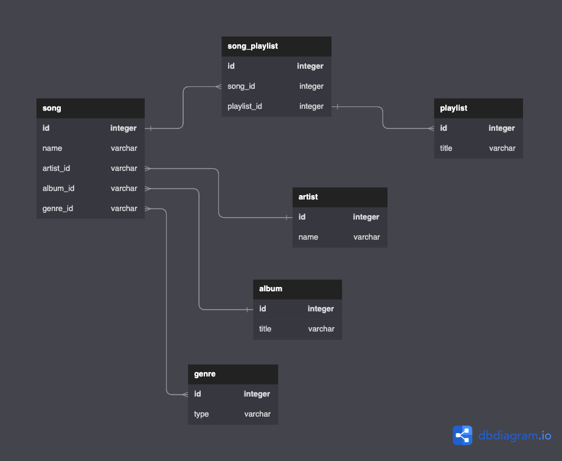

# **Django Jams**

## **Description**
- Create a music library database/API with Django

- Set up a Python/Django/Django REST Framework API app
- Create models that can be migrated into the database from a reference to a DB Diagram to serve as the backend for an application like spotify or apple music

Ports served:
- Postgres DB: 5432 (automatic)
- Django server: 8000 (when running manage.py runserver)

## **MVP**
- App should be able to perform CRUD operations on multiple models…
    - Song
    - Album
    - Artist
    - Playlists
- …as well as have routes to display information as JSON
- App should include all migrations for database models

## **Requirements**
- Create and submit (for approval) an object relationship diagram (dbdiagram.io)
	- Diagram should take into consideration:
		- Relationship between different tables
		- Considerations for null, blank fields, default values, other options
		- Account for ManyToMany tables in diagram, but not in Django
- Create models in Django to store data in PostgreSQL database
	- Minimum of (1) foreign key relationship
	- Minimum of (1) many to many relationship
- how READ functionality of all models through url collections from DRF with Thunder Client (VSCode Extension) requests for all models to get all data in each table/model
- Implement full CRUD for (at minimum) one model with at least one relationship
- Use Django REST Framework to build an api and routes for queries
- Use Thunder Client to prove the functionality of the Create, Read, Update, and Delete Routes.
	- You can also test some routes in the browser, as long as they are GET routes

## **Route Requirements**
- GET for all models at `/api/[model-name]/`- returns all objects for that model
	- Nested data is unnecessary for MVP, just FKs in the field data is ok
- GET for single instances of models `/api/[model-name]/[pk]/`- returns a single object
- POST routes for each model at `/api/model-name/pk`
- UPDATE routes for each model at `/api/model-name/pk`
- DELETE routes for each model at `/api/model-name/pk`

## **Tables/columns:**

- song
	- id
	- name
	- artist_id
	- album_id

- artist
	- id
	- name

- album
	- id
	- title

- genre
	- id
	- type

- playlist
	- id
	- title

- song_playlist
	- id
    - song_id
    - playlist_id
#

#
## **Models:**

    class Song(model.Model):
        name = models.CharField(max_length=100)
        artist = models.ForeignKey(‘Artist’, on_delete=models.PROTECT, null=True)
        album = models.ForeignKey(‘Album’, on_delete=models.PROTECT, null=True)
        playlists = models.ManyToManyField(‘Playlists’, on_delete=models.PROTECT, null=True)
        genres = models.ManyToManyField(‘Genre’, on_delete=models.PROTECT, null=True)

        def __str__(self):
            return self.name
#
    class Artist(model.Model):
        name = models.CharField(max_length=100)

        def __str__(self):
            return self.name
#
    class Album(model.Model):
        name = models.CharField(max_length=100)

        def __str__(self):
            return self.name
#
    class Genre(model.Model):
        name = models.CharField(max_length=100)

        def __str__(self):
            return self.name
#
    class Playlist(model.Model):
        name = models.CharField(max_length=100)

        def __str__(self):
            return self.name

## **Serializers:**
    import .models import Song, Artist, Album, Genre, Playlist

    class SongSerializer(serializers.ModelSerializer):
        class Meta:
            model = Song
            fields = ['name', 'artist_id', 'album_id', 'genre_id', 'songs_playlist']
    
    class ArtistSerializer(serializers.ModelSerializer):
        class Meta:
            model = Artist
            fields = ['name']

    class AlbumSerializer(serializers.ModelSerializer):
        class Meta:
            model = Album
            fields = ['name']
    
    class GenreSerializer(serializers.ModelSerializer):
        class Meta:
            model = Genre
            fields = ['name]

    class PlaylistSerializer(serializers.ModelSerializer):
        class Meta:
            model = Playlist
            fields = ['name']

## **Views**
### **(musiclibrary (PROJECT) folder)**

    from django.shortcuts import render
    from django.http import HttpResponse
    from .serializers import 
                        UserSerializer, 
                        GroupSerializer, 
                        SongSerializer, 
                        ArtistSerializer, 
                        AlbumSerializer,
                        GenreSerializer,
                        PlaylistSerializer

    class SongViewSet(viewsets.ModelViewSet):
        queryset = Song.objects.all()
        serializer_class = SongSerializer
    
    class ArtistViewSet(viewsets.ModelViewSet):
        queryset = Song.objects.all()
        serializer_class = ArtistSerializer
    
    class AlbumViewSet(viewsets.ModelViewSet):
        queryset = Song.objects.all()
        serializer_class = AlbumSerializer
    
    class GenreViewSet(viewsets.ModelViewSet):
        queryset = Song.objects.all()
        serializer_class = GenreSerializer
    
    class PlaylistViewSet(viewsets.ModelViewSet):
        queryset = Song.objects.all()
        serializer_class = PlaylistSerializer

## **URL's**
### **(djangojams (APP) folder)**

    from django.contrib import admin
    from django.urls import path, include
    from rest_framework import routers
    from musiclibrary import views

    router = routers.DefaultRouter()
    router.register(r'users', views.UserViewSet)
    router.register(r'groups', views.GroupViewSet)
    router.register(r'songs', views.SongViewSet)
    router.register(r'artists', views.ArtistViewSet)
    router.register(r'albums', views.AlbumViewSet)
    router.register(r'genres', views.GenresViewSet)
    router.register(r'playlists', views.PlaylistsViewSet)

    urlpatterns = [
    path('admin/', admin.site.urls),
    path('', include(router.urls)),
    ]